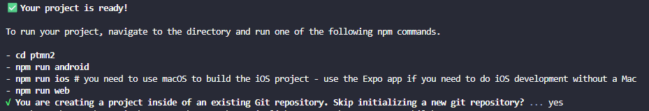

# Praktikum Menyipkan Lingkungan Pengembangan dan Memulai Pemrograman Mobile (React Native) 

## Tujuan Pembelajaran
Mahasiswa mampu:
1. Menyiapkan lingkungan pengembangan dan memulai pemrograman monnile (React Native)
2. Membuat aplikasi dengan react native 
3. Meneyelesaikan Tugas CV sederhana dengan React Native

- Memastikan istalasi git bash
- cek instalasi git bash (git --version)

2. Mmebuat aplikasi / project baru dengan Reaxt Native Framework Expo Go 
- Buka dan Baca Dokumentasi resmi link: https://docs.expo.dev/
- Buka dan Baca Dokumentasi resmi link: https://reactnative.dev/docs/getting-started
- memulai membuat project
- open teriminal change directory ke Pertemuan-2
- Masukkan perintah (npx create-expo-app-ptmn2 --template blank)
- Bukti verifikasi

Running Project
    -cd ptmn2
    -npx expo start
    -download expo go di hp
    -bisa juga menggunakan web emilator di laptop/pc
    -setelah berhentikan (ctrl + c)
    -install (npx expo start install react-dom react-native-web)
    -npx expo start--web