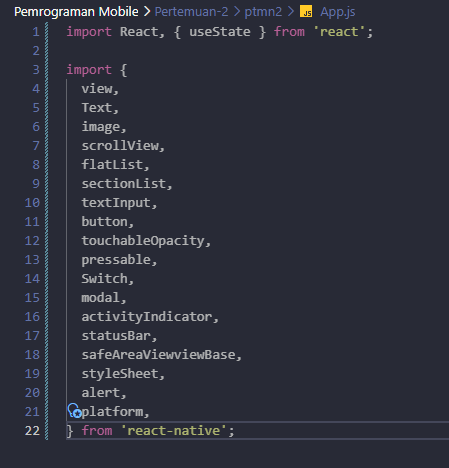
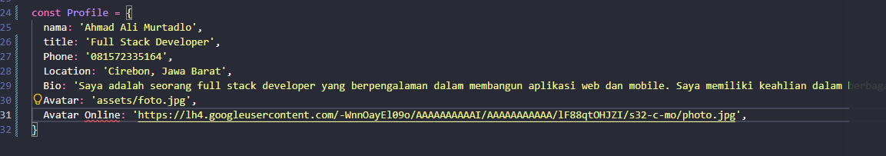
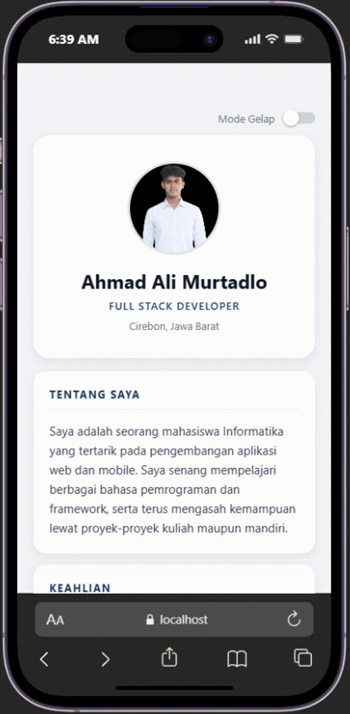

# Laporan Praktikum 3: Core Components dan Styling 


### Langkah 1: Import Library & commponents 
...

1. Buka file app.js yang ada di folder project ptnm2
2. Import Library dan Componenet yang diperlukan
3. Konfirmasi Bukti
    


### Langkah 2: Membuat Array Objek 

1. Mmebuat Objek Array bernaa Profile untuk wadah data Profile
2. Memasukkan data yang di perlukan
3. Konfirmasi Bukti


## 📝 LANGKAH 1 — Import & Struktur Dasar

**Konsep:** Semua komponen React Native diimpor dari `react-native`. Ikon sosial media (GitHub, Instagram, TikTok) memakai `@expo/vector-icons`, yang sudah bawaan Expo tanpa perlu install tambahan.

Buat proyek baru lalu buka `App.js` dan mulai dengan:

```jsx
import React, { useState, useEffect, useMemo } from 'react';
import {
  View,
  Text,
  Image,
  ScrollView,
  FlatList,
  SectionList,
  TextInput,
  Button,
  TouchableOpacity,
  Pressable,
  Switch,
  Modal,
  ActivityIndicator,
  StatusBar,
  StyleSheet,
  Alert,
  Platform,
  Linking,
} from 'react-native';
import { Ionicons } from '@expo/vector-icons';
```

**✅ Checkpoint:** Tidak ada error import saat menjalankan `npx expo start`.

---

## 📝 LANGKAH 2 — Menyiapkan Data (Profil, Link, Skill, Section)

**Konsep:** Data statis (tidak berubah saat aplikasi jalan) diletakkan **di luar** komponen `App()`, supaya tidak dibuat ulang setiap kali terjadi re-render.

```jsx
// ============================================
// DATA PROFIL
// ============================================
const Profile = {
  nama: 'Ahmad Ali Murtadlo',
  title: 'Mahasiswa Informatika',
  nim: '2488010056',
  asalSekolah: 'SMA Negeri 1 Lemahabang',
  citaCita: 'Fullstack Developer',
  rencana:
    'Belajar pemrograman secara konsisten, mengikuti proyek dan magang, ' +
    'membangun portofolio, serta memperluas jaringan di bidang teknologi.',
  phone: '081572335164',
  location: 'Cirebon, Jawa Barat',
  bio: 'Saya adalah seorang mahasiswa Informatika yang tertarik pada pengembangan aplikasi web dan mobile. Saya senang mempelajari berbagai bahasa pemrograman dan framework, serta terus mengasah kemampuan lewat proyek-proyek kuliah maupun mandiri.',
  avatar: require('./assets/foto.jpg'),
};

// ============================================
// DATA LINK (profesional & sosial media)
// ============================================
const LINKS = {
  profesional: [
    {
      key: 'github',
      label: 'GitHub',
      handle: 'github.com/4ldooo',
      url: 'https://github.com/4ldooo',
      icon: 'logo-github',
    },
  ],
  sosmed: [
    {
      key: 'instagram',
      label: 'Instagram',
      handle: '@Shaggydo._',
      url: 'https://instagram.com/Shaggydo._',
      icon: 'logo-instagram',
    },
    {
      key: 'tiktok',
      label: 'TikTok',
      handle: '@username',
      url: 'https://www.tiktok.com/@username',
      icon: 'logo-tiktok',
    },
  ],
};

// ============================================
// DATA SKILL (array of strings)
// → ditampilkan dengan FlatList
// ============================================
const SKILLS = ['JavaScript', 'React Native', 'React', 'Node.js', 'SQL', 'Git'];

// ============================================
// DATA DETAIL (sections)
// → ditampilkan dengan SectionList di dalam Modal
// ============================================
const SECTIONS = [
  {
    title: 'Pendidikan',
    data: [
      { label: 'Asal Sekolah', value: Profile.asalSekolah },
      { label: 'NIM', value: Profile.nim },
    ],
  },
  {
    title: 'Tujuan Karier',
    data: [
      { label: 'Cita-cita', value: Profile.citaCita },
      { label: 'Rencana', value: Profile.rencana },
    ],
  },
  {
    title: 'Kontak',
    data: [
      { label: 'No. HP', value: Profile.phone },
      { label: 'Lokasi', value: Profile.location },
    ],
  },
];
```

> [!NOTE]
> **Kenapa foto pakai `require('./assets/foto.jpg')` bukan URL?**
> `require` dengan path lokal membuat gambar ikut ter-bundle bersama aplikasi, jadi tetap tampil walau tidak ada koneksi internet. Kalau memakai `{ uri: 'https://...' }`, gambar baru dimuat saat ada internet.

**✅ Checkpoint:** Belum ada tampilan berubah, tapi tidak ada error saat menyimpan file.

---

## 📝 LANGKAH 3 — Tema Warna (Light & Dark)

**Konsep:** Daripada menulis warna berulang-ulang, semua warna dikumpulkan dalam satu objek `themes`. Nanti tinggal pilih `themes.light` atau `themes.dark` berdasarkan state.

```jsx
const NAVY = '#1e3a5f';

const themes = {
  light: {
    bg: '#f5f6f8',
    card: '#ffffff',
    text: '#111827',
    sub: '#6b7280',
    body: '#374151',
    border: '#e5e7eb',
    accent: NAVY,
    chip: '#eef2f7',
    input: '#f9fafb',
  },
  dark: {
    bg: '#0b1220',
    card: '#151f32',
    text: '#f1f5f9',
    sub: '#94a3b8',
    body: '#cbd5e1',
    border: '#26334a',
    accent: '#93c5fd',
    chip: '#22304a',
    input: '#0f182a',
  },
};
```

**✅ Checkpoint:** Belum terlihat efeknya di layar — objek ini baru dipakai di langkah berikutnya.

---

## 📝 LANGKAH 4 — State Management dengan useState & useMemo

**Konsep:**
- `loading` → menampilkan spinner sebelum konten CV muncul
- `darkMode` → menentukan tema aktif
- `detailVisible` → mengontrol tampil/sembunyi Modal
- `message` → menyimpan teks dari form kontak
- `useMemo` dipakai supaya `styles` hanya dihitung ulang saat `darkMode` berubah, bukan setiap render

Mulai fungsi komponen:

```jsx
export default function App() {
  const [loading, setLoading] = useState(true);
  const [darkMode, setDarkMode] = useState(false);
  const [detailVisible, setDetailVisible] = useState(false);
  const [message, setMessage] = useState('');

  const t = darkMode ? themes.dark : themes.light;
  const styles = useMemo(() => makeStyles(t), [darkMode]);

  useEffect(() => {
    const timer = setTimeout(() => setLoading(false), 1000);
    return () => clearTimeout(timer);
  }, []);
```

**✅ Checkpoint:** Tidak ada error di terminal setelah menyimpan.

---

## 📝 LANGKAH 5 — Fungsi Handler (Kirim Pesan & Buka Link)

**Konsep:** Fungsi-fungsi ini dipanggil saat pengguna berinteraksi — kirim pesan, tekan baris kontak, atau tekan link sosial media.

```jsx
  const handleSend = () => {
    if (!message.trim()) {
      Alert.alert('Pesan kosong', 'Tulis pesan terlebih dahulu.');
      return;
    }
    Alert.alert('Pesan terkirim', `Terima kasih, pesanmu untuk ${Profile.nama} sudah dikirim.`);
    setMessage('');
  };

  const handleContact = (item) => {
    Alert.alert(item.label, item.value);
  };

  const openLink = async (url) => {
    try {
      await Linking.openURL(url);
    } catch (e) {
      Alert.alert('Gagal membuka link', 'Link tidak bisa dibuka di perangkat ini.');
    }
  };
```

> [!TIP]
> `Linking.openURL` membuka link di browser atau aplikasi terkait (misalnya link TikTok bisa langsung membuka aplikasi TikTok jika terpasang).

**✅ Checkpoint:** Belum ada tombol yang memanggil fungsi ini — akan dipakai di langkah 8 dan 9.

---

## 📝 LANGKAH 6 — Sub-Render: Baris Link (Pressable)

**Konsep:** Karena baris link (GitHub, Instagram, TikTok) tampilannya sama persis, dibuat satu fungsi `renderLinkRow` yang dipakai berulang — ini praktik **component reuse**.

```jsx
  const renderLinkRow = (item, isLast) => (
    <Pressable
      key={item.key}
      onPress={() => openLink(item.url)}
      style={({ pressed }) => [
        styles.linkRow,
        !isLast && styles.linkRowGap,
        pressed && styles.pressed,
      ]}
    >
      <View style={styles.linkIcon}>
        <Ionicons name={item.icon} size={20} color={t.accent} />
      </View>
      <View style={styles.linkText}>
        <Text style={styles.linkLabel}>{item.label}</Text>
        <Text style={styles.linkHandle} numberOfLines={1}>
          {item.handle}
        </Text>
      </View>
      <Ionicons name="open-outline" size={18} color={t.sub} />
    </Pressable>
  );
```

> [!NOTE]
> **`Pressable` vs `TouchableOpacity`:** `Pressable` memberi kontrol penuh atas style saat ditekan lewat parameter `({ pressed }) => [...]`, sedangkan `TouchableOpacity` otomatis meredupkan opacity tanpa perlu diatur manual.

**✅ Checkpoint:** Fungsi siap dipakai, belum terlihat di layar.

---

## 📝 LANGKAH 7 — Layar Loading (ActivityIndicator)

**Konsep:** Selama `loading` bernilai `true`, tampilkan spinner dulu sebelum konten CV dirender.

```jsx
  if (loading) {
    return (
      <View style={[styles.container, styles.center]}>
        <StatusBar barStyle={darkMode ? 'light-content' : 'dark-content'} />
        <ActivityIndicator size="large" color={t.accent} />
        <Text style={styles.loadingText}>Memuat profil...</Text>
      </View>
    );
  }
```

**✅ Checkpoint:** Saat aplikasi pertama dibuka, muncul spinner selama ± 1 detik sebelum CV tampil.

---

## 📝 LANGKAH 8 — Header: Toggle Tema, Foto, Nama, Jabatan

**Konsep:**
- `Switch` → mengganti `darkMode`
- `Image` → menampilkan foto dari `require`
- `ScrollView` → membungkus seluruh konten CV agar bisa digulir

```jsx
  return (
    <View style={styles.container}>
      <StatusBar barStyle={darkMode ? 'light-content' : 'dark-content'} backgroundColor={t.bg} />

      <ScrollView
        contentContainerStyle={styles.content}
        showsVerticalScrollIndicator={false}
        keyboardShouldPersistTaps="handled"
      >
        {/* Toggle mode gelap */}
        <View style={styles.themeRow}>
          <Text style={styles.themeLabel}>Mode Gelap</Text>
          <Switch
            value={darkMode}
            onValueChange={setDarkMode}
            trackColor={{ false: '#d1d5db', true: t.accent }}
            thumbColor="#ffffff"
          />
        </View>

        {/* Header */}
        <View style={styles.header}>
          <Image source={Profile.avatar} style={styles.photo} />
          <Text style={styles.name}>{Profile.nama}</Text>
          <Text style={styles.title}>{Profile.title}</Text>
          <Text style={styles.location}>{Profile.location}</Text>
        </View>
```

**✅ Checkpoint:** Foto, nama "Ahmad Ali Murtadlo", dan jabatan "Mahasiswa Informatika" tampil di kartu putih/gelap. Toggle switch berhasil mengganti tema.

---

## 📝 LANGKAH 9 — Kartu Tentang Saya & FlatList Keahlian

**Konsep:** `FlatList` dengan `horizontal` menampilkan skill sebagai chip yang bisa digeser ke samping.

```jsx
        {/* Tentang */}
        <View style={styles.card}>
          <Text style={styles.sectionTitle}>Tentang Saya</Text>
          <View style={styles.divider} />
          <Text style={styles.paragraph}>{Profile.bio}</Text>
        </View>

        {/* Skill */}
        <View style={styles.card}>
          <Text style={styles.sectionTitle}>Keahlian</Text>
          <View style={styles.divider} />
          <FlatList
            data={SKILLS}
            keyExtractor={(item) => item}
            horizontal
            showsHorizontalScrollIndicator={false}
            renderItem={({ item }) => (
              <View style={styles.chip}>
                <Text style={styles.chipText}>{item}</Text>
              </View>
            )}
          />
        </View>
```

**✅ Checkpoint:** Paragraf bio tampil, dan daftar skill (JavaScript, React Native, dst) bisa digeser horizontal.

---

## 📝 LANGKAH 10 — Profesional, Sosial Media & Kontak (Pressable)

**Konsep:** Memanggil `renderLinkRow` yang sudah dibuat di Langkah 6, lalu menampilkan baris kontak dengan `Pressable` biasa.

```jsx
        {/* Profesional: GitHub */}
        <View style={styles.card}>
          <Text style={styles.sectionTitle}>Profesional</Text>
          <View style={styles.divider} />
          {LINKS.profesional.map((item, i) =>
            renderLinkRow(item, i === LINKS.profesional.length - 1)
          )}
        </View>

        {/* Sosial media */}
        <View style={styles.card}>
          <Text style={styles.sectionTitle}>Sosial Media</Text>
          <View style={styles.divider} />
          {LINKS.sosmed.map((item, i) =>
            renderLinkRow(item, i === LINKS.sosmed.length - 1)
          )}
        </View>

        {/* Kontak cepat */}
        <View style={styles.card}>
          <Text style={styles.sectionTitle}>Kontak</Text>
          <View style={styles.divider} />
          <Pressable
            onPress={() => handleContact({ label: 'No. HP', value: Profile.phone })}
            style={({ pressed }) => [styles.contactRow, pressed && styles.pressed]}
          >
            <Text style={styles.rowLabel}>No. HP</Text>
            <Text style={styles.rowValue}>{Profile.phone}</Text>
          </Pressable>
          <Pressable
            onPress={() => handleContact({ label: 'Lokasi', value: Profile.location })}
            style={({ pressed }) => [styles.contactRow, pressed && styles.pressed]}
          >
            <Text style={styles.rowLabel}>Lokasi</Text>
            <Text style={styles.rowValue}>{Profile.location}</Text>
          </Pressable>
        </View>
```

**✅ Checkpoint:** Tekan baris GitHub/Instagram/TikTok membuka link di browser/aplikasi. Tekan baris kontak memunculkan `Alert`.

---

## 📝 LANGKAH 11 — Tombol Detail & Form Pesan (TextInput, Button)

**Konsep:**
- `TouchableOpacity` untuk tombol yang membuka Modal
- `TextInput` dengan `multiline` untuk kolom pesan — ini contoh **controlled component** karena nilainya diatur lewat `value` + `onChangeText`

```jsx
        {/* Tombol detail */}
        <TouchableOpacity
          style={styles.primaryButton}
          activeOpacity={0.8}
          onPress={() => setDetailVisible(true)}
        >
          <Text style={styles.primaryButtonText}>Lihat Detail Lengkap</Text>
        </TouchableOpacity>

        {/* Form pesan */}
        <View style={styles.card}>
          <Text style={styles.sectionTitle}>Kirim Pesan</Text>
          <View style={styles.divider} />
          <TextInput
            style={styles.input}
            placeholder="Tulis pesan untuk saya..."
            placeholderTextColor={t.sub}
            value={message}
            onChangeText={setMessage}
            multiline
          />
          <View style={styles.buttonWrap}>
            <Button title="Kirim" color={darkMode ? '#3b82f6' : NAVY} onPress={handleSend} />
          </View>
        </View>

        <Text style={styles.footer}>{Profile.nama}</Text>
      </ScrollView>
```

> [!TIP]
> **Controlled vs Uncontrolled Component:** Controlled (`value` + `onChangeText`) membuat nilai input selalu sinkron dengan state React — inilah pendekatan yang direkomendasikan.

**✅ Checkpoint:** Tekan "Kirim" tanpa mengisi pesan → muncul peringatan. Isi pesan lalu kirim → muncul `Alert` sukses dan kolom kembali kosong.

---

## 📝 LANGKAH 12 — Modal Detail dengan SectionList

**Konsep:** `Modal` menampilkan `SectionList` yang mengelompokkan data berdasarkan `title` (Pendidikan, Tujuan Karier, Kontak) — beda dengan `FlatList` yang datanya rata tanpa pengelompokan.

```jsx
      {/* Modal detail dengan SectionList */}
      <Modal
        visible={detailVisible}
        animationType="slide"
        onRequestClose={() => setDetailVisible(false)}
      >
        <View style={styles.modalContainer}>
          <View style={styles.modalHeader}>
            <Text style={styles.modalTitle}>Detail Lengkap</Text>
            <TouchableOpacity onPress={() => setDetailVisible(false)}>
              <Text style={styles.closeText}>Tutup</Text>
            </TouchableOpacity>
          </View>

          <SectionList
            sections={SECTIONS}
            keyExtractor={(item) => item.label}
            contentContainerStyle={styles.modalContent}
            stickySectionHeadersEnabled={false}
            renderSectionHeader={({ section }) => (
              <Text style={styles.modalSection}>{section.title}</Text>
            )}
            renderItem={({ item }) => (
              <View style={styles.modalItem}>
                <Text style={styles.rowLabel}>{item.label}</Text>
                <Text style={styles.rowValue}>{item.value}</Text>
              </View>
            )}
          />
        </View>
      </Modal>
    </View>
  );
}
```

> [!NOTE]
> **`onRequestClose`** wajib diisi di Android agar tombol back fisik/gesture bisa menutup Modal, meskipun isinya sama dengan tombol "Tutup".

**✅ Checkpoint:** Tekan "Lihat Detail Lengkap" → Modal muncul dari bawah, berisi 3 kelompok data. Tekan "Tutup" atau tombol back → Modal hilang.

---

## 📝 LANGKAH 13 — StyleSheet Dinamis (makeStyles)

**Konsep:** Karena style bergantung pada tema (`t`), `StyleSheet.create()` dibungkus dalam fungsi `makeStyles(t)` yang menerima objek warna sebagai parameter, lalu dipanggil ulang tiap `darkMode` berubah (lihat Langkah 4).

```jsx
const makeStyles = (t) => {
  const cardShadow = Platform.select({
    ios: {
      shadowColor: '#000',
      shadowOpacity: 0.08,
      shadowRadius: 12,
      shadowOffset: { width: 0, height: 4 },
    },
    android: { elevation: 2 },
    default: { boxShadow: '0 4px 12px rgba(0, 0, 0, 0.08)' },
  });

  const topPad = Platform.OS === 'android' ? StatusBar.currentHeight || 24 : 50;
  const isDark = t.bg === themes.dark.bg;

  return StyleSheet.create({
    container: { flex: 1, backgroundColor: t.bg },
    center: { alignItems: 'center', justifyContent: 'center' },
    loadingText: { marginTop: 12, color: t.sub, fontSize: 14 },
    content: { padding: 20, paddingTop: topPad + 8, paddingBottom: 40 },

    themeRow: {
      flexDirection: 'row',
      alignItems: 'center',
      justifyContent: 'flex-end',
      marginBottom: 12,
      gap: 10,
    },
    themeLabel: { fontSize: 13, color: t.sub },

    header: {
      alignItems: 'center',
      backgroundColor: t.card,
      borderRadius: 20,
      paddingVertical: 32,
      paddingHorizontal: 20,
      marginBottom: 16,
      ...cardShadow,
    },
    photo: { width: 116, height: 116, borderRadius: 58, borderWidth: 3, borderColor: t.border },
    name: { fontSize: 24, fontWeight: '700', color: t.text, marginTop: 16, textAlign: 'center' },
    title: {
      fontSize: 13,
      fontWeight: '600',
      color: t.accent,
      marginTop: 6,
      letterSpacing: 1,
      textTransform: 'uppercase',
    },
    location: { fontSize: 13, color: t.sub, marginTop: 8 },

    card: { backgroundColor: t.card, borderRadius: 16, padding: 20, marginBottom: 14, ...cardShadow },
    sectionTitle: { fontSize: 13, fontWeight: '700', color: t.accent, letterSpacing: 1.5, textTransform: 'uppercase' },
    divider: { height: 1, backgroundColor: t.border, marginTop: 10, marginBottom: 14 },
    paragraph: { fontSize: 15, lineHeight: 24, color: t.body },

    chip: { backgroundColor: t.chip, paddingHorizontal: 14, paddingVertical: 8, borderRadius: 20, marginRight: 8 },
    chipText: { fontSize: 13, fontWeight: '600', color: t.accent },

    linkRow: { flexDirection: 'row', alignItems: 'center', padding: 8, borderRadius: 12 },
    linkRowGap: { marginBottom: 6 },
    linkIcon: {
      width: 40,
      height: 40,
      borderRadius: 10,
      backgroundColor: t.chip,
      alignItems: 'center',
      justifyContent: 'center',
      marginRight: 14,
    },
    linkText: { flex: 1, marginRight: 8 },
    linkLabel: { fontSize: 15, fontWeight: '600', color: t.text },
    linkHandle: { fontSize: 12, color: t.sub, marginTop: 2 },

    contactRow: { paddingVertical: 10, paddingHorizontal: 8, borderRadius: 10 },
    pressed: { backgroundColor: t.chip },
    rowLabel: { fontSize: 12, color: t.sub, marginBottom: 2 },
    rowValue: { fontSize: 15, lineHeight: 22, color: t.text },

    primaryButton: { backgroundColor: t.accent, paddingVertical: 14, borderRadius: 14, alignItems: 'center', marginBottom: 14 },
    primaryButtonText: { color: isDark ? '#0b1220' : '#ffffff', fontSize: 15, fontWeight: '700', letterSpacing: 0.5 },

    input: {
      minHeight: 90,
      backgroundColor: t.input,
      borderWidth: 1,
      borderColor: t.border,
      borderRadius: 12,
      padding: 12,
      fontSize: 15,
      color: t.text,
      textAlignVertical: 'top',
    },
    buttonWrap: { marginTop: 12 },
    footer: { textAlign: 'center', color: t.sub, fontSize: 12, marginTop: 10 },

    modalContainer: { flex: 1, backgroundColor: t.bg },
    modalHeader: {
      flexDirection: 'row',
      alignItems: 'center',
      justifyContent: 'space-between',
      paddingHorizontal: 20,
      paddingTop: topPad + 8,
      paddingBottom: 16,
      backgroundColor: t.card,
      borderBottomWidth: 1,
      borderBottomColor: t.border,
    },
    modalTitle: { fontSize: 18, fontWeight: '700', color: t.text },
    closeText: { fontSize: 15, fontWeight: '600', color: t.accent },
    modalContent: { padding: 20, paddingBottom: 40 },
    modalSection: {
      fontSize: 13,
      fontWeight: '700',
      color: t.accent,
      letterSpacing: 1.5,
      textTransform: 'uppercase',
      marginTop: 16,
      marginBottom: 10,
    },
    modalItem: { backgroundColor: t.card, borderRadius: 12, padding: 14, marginBottom: 10 },
  });
};
```

**✅ Checkpoint:** Tidak ada error, dan tampilan berubah total antara mode terang dan gelap saat `Switch` ditekan.

---

## ✅ LANGKAH 14 — Verifikasi & Pengujian

| # | Yang Diuji | Hasil yang Diharapkan |
|---|---|---|
| 1 | Aplikasi bisa dibuka | Spinner tampil ± 1 detik, lalu layar CV muncul tanpa error |
| 2 | Foto profil tampil | Foto dari `assets/foto.jpg` terlihat dalam bingkai bulat |
| 3 | Toggle Mode Gelap | Seluruh warna berubah ke tema dark, ikon dan teks tetap terbaca |
| 4 | Halaman bisa di-scroll | Semua kartu (Tentang, Keahlian, Profesional, dst) bisa diakses |
| 5 | FlatList Keahlian | Chip skill bisa digeser horizontal |
| 6 | Tekan link GitHub/Instagram/TikTok | Browser/aplikasi terkait terbuka |
| 7 | Tekan baris Kontak | `Alert` menampilkan No. HP / Lokasi |
| 8 | Tekan "Lihat Detail Lengkap" | Modal muncul dari bawah, berisi 3 section |
| 9 | Tombol "Tutup" di Modal | Modal tertutup, kembali ke layar utama |
| 10 | Isi form & tekan "Kirim" | `Alert` sukses muncul, kolom pesan kosong kembali |
| 11 | Tekan "Kirim" dengan pesan kosong | `Alert` peringatan "Pesan kosong" muncul |

---

### Bukti Hasil Akhir


